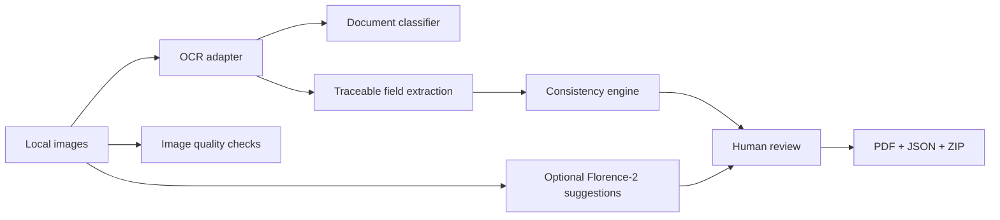

# ClaimKit Local

> Turn appliance photos, receipts and warranty documents into a structured,
> reviewable warranty evidence package — entirely on your machine.

ClaimKit Local organizes the evidence needed for a household-appliance quality
claim. It extracts traceable fields, detects disagreements between documents,
checks image quality, and exports an auditable PDF/ZIP package. It does **not**
decide whether a claim is legally valid and never submits anything on your behalf.


## See it work

```bash
uv sync
uv run claimkit demo
```

The command creates synthetic English/Russian evidence, deliberately puts
`WM-420` on the receipt and `WM-421` on the warranty card, reports the conflict,
and writes `demo/generated/claim-package.zip`.

A rendered sample is included at [`output/pdf/claim-summary-demo.pdf`](output/pdf/claim-summary-demo.pdf).

```text
5 evidence images
        │
        ├── receipt ─────────── model WM-420 ─┐
        ├── warranty card ───── model WM-421 ─┼── conflict for human review
        ├── serial label ────── model WM-420 ─┘
        ├── product overview
        └── damage photo
                         ↓
       PDF summary + manifest + originals + review letter
```

## Features

- English and Russian OCR through an optional local [PaddleOCR](https://github.com/PaddlePaddle/PaddleOCR) adapter.
- Model-free deterministic demo via explicit OCR sidecars (no hidden network calls).
- Classification of receipts, warranty cards, serial labels, product views and damage photos.
- Traceable extraction of manufacturer, model, serial number, seller, purchase date,
  price and warranty duration.
- Cross-document conflict detection without silently choosing a value.
- Blur, exposure, resolution and exact-duplicate checks.
- Optional local [Florence-2](https://huggingface.co/microsoft/Florence-2-base) adapter;
  every suggestion remains unconfirmed.
- PDF/JSON/ZIP export that preserves originals and refuses to overwrite a non-empty directory.

## Local app

```bash
uv sync --extra app --extra ocr
uv run streamlit run src/claimkit/app.py
```

To enable local Florence-2 suggestions, repeat the sync with `--extra vlm`. PaddleOCR
weights are downloaded on first OCR use; Florence-2 weights are downloaded only after
you select its checkbox or pass `--florence`. Both run locally after that download.

## CLI

```bash
claimkit inspect ./evidence --lang ru
claimkit build ./evidence --output ./claim-package --description "Door seal is leaking"
claimkit build ./evidence --output ./claim-package --florence
claimkit demo --output ./demo/generated
claimkit evaluate --output ./demo/evaluation.json
```

## Architecture



## Evaluation

The generated fixture supplies normalized ground truth. Core tests verify date and
currency normalization, the seeded model conflict, package contents, image-quality
warnings and non-overwrite behavior. Heavy OCR/VLM tests live in a manually triggered
workflow so ordinary CI is fast and deterministic. The integration suite runs
pixel-only English/Russian OCR and a real Florence-2 caption-plus-grounding pass.

The committed [`demo/evaluation.json`](demo/evaluation.json) reports 8/8 normalized
field values and 1/1 seeded conflicts on the synthetic fixture. These numbers verify
the deterministic pipeline; they are not presented as real-document OCR accuracy.

```bash
uv sync --extra dev --extra app
uv run pytest -m "not integration"
uv run ruff check .
uv run mypy src/claimkit
```

## Privacy and threat model

- Processing and exports are local; no document is sent to an inference API.
- The committed Streamlit configuration binds the review UI to `127.0.0.1` only.
- Optional third-party model libraries may download model weights on first use;
  the Florence-2 code path pins a reviewed model revision.
- Telemetry is disabled in the integration workflow and can remain disabled offline.
- Original evidence is copied, never modified.
- Generated letters contain only confirmed structured fields and user-provided text.
- Output packages still contain personal data. Store and send them appropriately.
- A malicious or malformed image may stress third-party decoders; do not expose the
  Streamlit development server to untrusted networks.

## Limitations

- MVP scope is household appliances, not phones, vehicles or medical equipment.
- OCR quality depends on focus, lighting, language and document layout.
- Florence-2 captions and regions are uncalibrated suggestions, not damage diagnosis.
- ClaimKit does not interpret warranty law, determine fault, or guarantee acceptance.
- The Streamlit UI is a local review surface, not a hardened multi-user service.

## License

MIT
