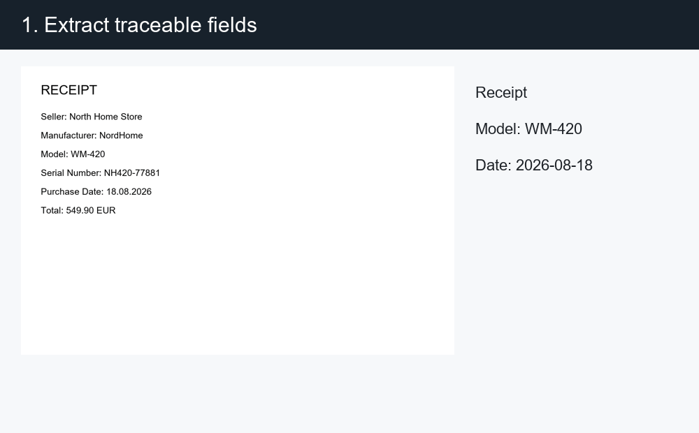
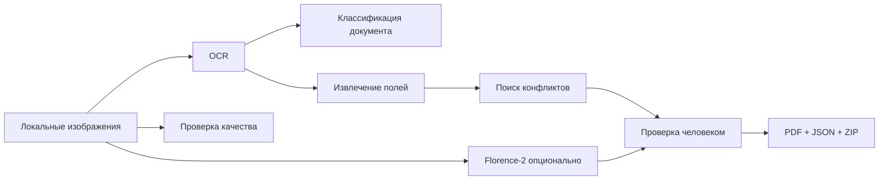

[English](README.md) | [Русский](README.ru.md)

# ClaimKit Local

> Превращает фотографии техники, чек и гарантийные документы в структурированный,
> проверяемый пакет доказательств — полностью на вашем компьютере.

ClaimKit Local помогает подготовить материалы для обращения по качеству бытовой техники.
Приложение извлекает поля со ссылками на источники, обнаруживает расхождения между
документами, проверяет качество изображений и экспортирует PDF/ZIP-пакет. Оно не определяет
юридическую обоснованность требования и ничего не отправляет от имени пользователя.



## Быстрый запуск

Установите [uv](https://docs.astral.sh/uv/getting-started/installation/), клонируйте
репозиторий и запустите файл для своей операционной системы. Скрипт подготовит Python 3.12,
создаст изолированное окружение `.venv`, установит зафиксированные зависимости и откроет
локальный интерфейс по адресу `http://127.0.0.1:8501`.

**Windows:** дважды щёлкните по `run.bat` или выполните:

```powershell
.\run.bat
```

**Windows PowerShell:**

```powershell
.\run.ps1
```

**macOS / Linux:**

```bash
chmod +x run.sh
./run.sh
```

Обычный запуск устанавливает интерфейс и PaddleOCR. Для установки более тяжёлого стека
Florence-2 используйте `run.bat -Full`, `.\run.ps1 -Full` или `./run.sh --full`.
Флаг `-SetupOnly` в Windows или `--setup-only` в macOS/Linux только подготовит окружение,
не запуская сервер. При первом использовании OCR/VLM могут загрузиться веса моделей.

## Демонстрация

```bash
uv sync --locked
uv run claimkit demo
```

Команда создаёт синтетические англо- и русскоязычные документы, намеренно указывает
`WM-420` в чеке и `WM-421` в гарантийном талоне, обнаруживает конфликт и сохраняет
`demo/generated/claim-package.zip`. Пример PDF находится в
[`output/pdf/claim-summary-demo.pdf`](output/pdf/claim-summary-demo.pdf).

```text
5 изображений
        │
        ├── чек ───────────────── модель WM-420 ─┐
        ├── гарантийный талон ─── модель WM-421 ─┼── конфликт для проверки
        ├── шильдик ───────────── модель WM-420 ─┘
        ├── общий вид прибора
        └── фотография повреждения
                              ↓
       PDF + manifest + оригиналы + письмо
```

## Возможности

- Локальный English/Russian OCR через PaddleOCR.
- Детерминированная демонстрация без скрытых сетевых запросов.
- Классификация чеков, гарантийных талонов, шильдиков, общих видов и повреждений.
- Извлечение производителя, модели, серийного номера, продавца, даты, цены и гарантии.
- Координаты и ссылка на исходный документ для каждого извлечённого значения.
- Поиск междокументных конфликтов без автоматического выбора «правильного» значения.
- Проверка размытия, пересвета, разрешения и точных дубликатов.
- Локальные предложения Florence-2, которые всегда требуют подтверждения.
- PDF/JSON/ZIP-экспорт с неизменными оригиналами и защитой от перезаписи.

## Ручной запуск интерфейса

Файлы запуска выше являются рекомендуемым способом. Эквивалентные ручные команды:

```bash
uv sync --locked --extra app --extra ocr
uv run streamlit run src/claimkit/app.py
```

Для Florence-2 добавьте `--extra vlm`. PaddleOCR загружает языковые модели при первом
распознавании, а Florence-2 — только после включения соответствующей опции.

## CLI

```bash
uv run claimkit inspect ./evidence --lang ru
uv run claimkit build ./evidence --output ./claim-package --description "Door seal is leaking"
uv run claimkit build ./evidence --output ./claim-package --florence
uv run claimkit demo --output ./demo/generated
uv run claimkit evaluate --output ./demo/evaluation.json
```

## Архитектура



## Проверка качества

Синтетический набор содержит эталонные нормализованные значения. Тесты проверяют даты,
валюты, заранее внесённый конфликт, структуру пакета, предупреждения о качестве и запрет
перезаписи. Тяжёлые OCR/VLM-тесты запускаются отдельным ручным workflow.

```bash
uv sync --locked --extra dev --extra app
uv run pytest -m "not integration"
uv run ruff check .
uv run mypy --package claimkit
```

## Приватность и модель угроз

- Документы обрабатываются локально и не отправляются в inference API.
- Streamlit слушает только `127.0.0.1`.
- Сторонние библиотеки могут загрузить веса при первом запуске; ревизия Florence-2 закреплена.
- Оригиналы копируются и никогда не изменяются.
- Письмо содержит только подтверждённые поля и введённое пользователем описание.
- Экспортированный пакет содержит персональные данные — храните и передавайте его осторожно.
- Локальный Streamlit-интерфейс не предназначен для публикации в недоверенной сети.

## Ограничения

- MVP предназначен для бытовой техники, но не для телефонов, автомобилей или медоборудования.
- Качество OCR зависит от фокуса, освещения, языка и структуры документа.
- Florence-2 предлагает области, но не диагностирует повреждение.
- ClaimKit не толкует гарантийное право и не гарантирует принятие обращения.

## Лицензия

MIT
